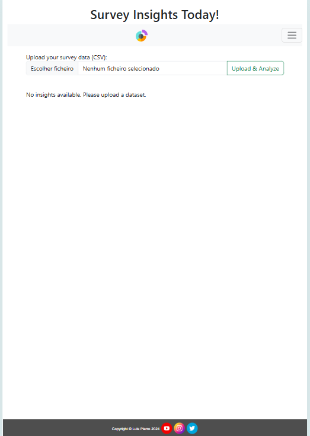
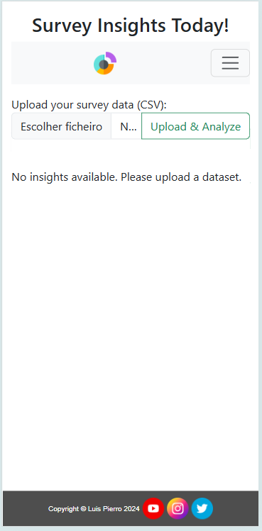
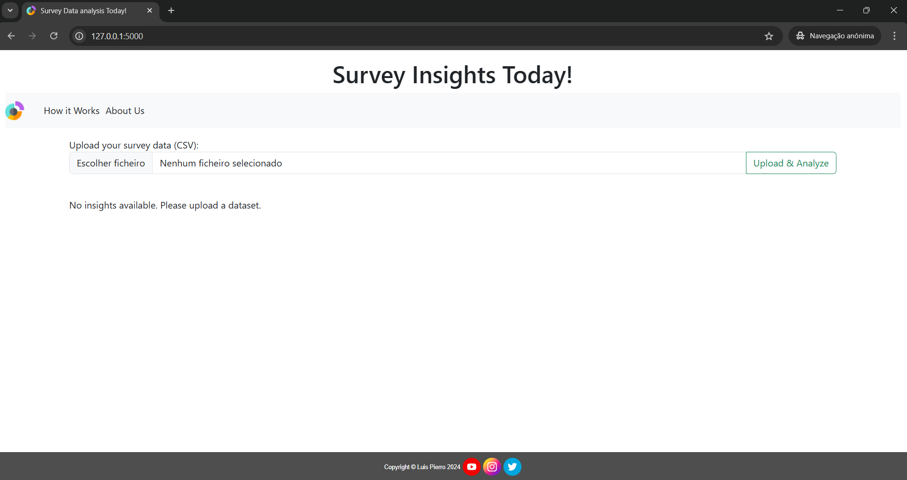
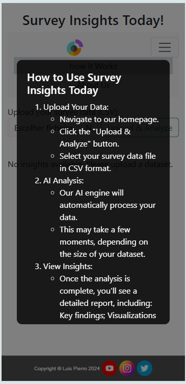
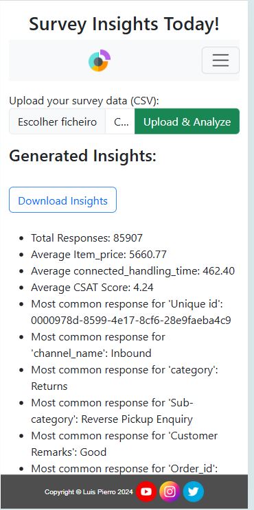

# Survey Insights Today: Your Data, Simplified

Dive into the depths of your survey data with ease. Upload your CSV file, and let our AI do the heavy lifting. In just a few clicks, you'll unlock valuable insights and actionable recommendations. Delve into a comprehensive report, complete with clear and concise summaries, visually appealing charts and graphs, and in-depth statistical analysis. Save your customized PDF report for future reference or sharing with colleagues. Experience the future of data analysis today.

## Design

### Wireframes

#### Desktop

#### Smartphones
!

### Screens

Our Website on Tablets

Our Website on Mobiles

Our Website on Desktops

## Features

- __Upload CSV File__

- Full responsive, the user can upload their csv survey file trough a easy and intuitive form. The has a validation to ensure that user correctly upload a csv file.

- __Website Help__

- This modern overlay provides a clear, concise description of the website functions, designed for easy understanding at a glance. Users can access it anytime during the visit without disrupting their experience or needing to leave the page. The overlay blends seamlessly with the interface, ensuring that essential information is always just a click away, helping users stay focused and informed as they explore the insights.

__Insights__

- The website prepare a set of insights and display it on a easy way on the screen:

__Download Insights__

- The website displays a easy and intuitive button so the user can download the result insights into a PDF file.

### Features Left to Implement

- User Login
  - With the new topics of the course, It will be possible to store credential information to make user login possible.
- Store previous user generated insights
  - Would need a database or something to store it.

## Testing

The website was developed and thought for three major screen sizes: Phones -max 599px; Tablet -min 600px; Laptops and Desktops- min 992px.

It was tested using the inspect feature of the chrome browser and my actual phone and tablet.

### Validator Testing 

- PEP8 Python Validator
  - No errors passing through the validator: [PEP8 Python Validator](static/assets/PEP8.png)

- JavaScript Linter
  - No errors passing through the validator: [Jshint linter](static/assets/jshint.png)

- HTML
  - No errors passing through the validator: [W3C validator](https://validator.w3.org/nu/?doc=https%3A%2F%2Fproject3-codeinstitute-2004aef5d4d7.herokuapp.com%2F)

- CSS
  - No erros passing through the validator. [(Jigsaw) validator](https://jigsaw.w3.org/css-validator/validator?uri=https%3A%2F%2Fproject3-codeinstitute-2004aef5d4d7.herokuapp.com%2F&profile=css3svg&usermedium=all&warning=1&vextwarning=&lang=pt-BR)

- Accessibility
  - No erros passing through the validator. Only one alert of skipping heading level. However, the break is intended once the text is into a orverlay box. [(Wave) validator](https://wave.webaim.org/report#/https://project3-codeinstitute-2004aef5d4d7.herokuapp.com/)

### Unfixed Bugs

No major bugs left to be fixed.

## Deployment 

- The site was deployed to GitHub pages. The steps to deploy are as follows: 
  - In the GitHub repository, navigate to the Settings tab 
  - From the source section drop-down menu, select the Master Branch
  - Once the master branch has been selected, the page will be automatically refreshed with a detailed ribbon display to indicate the successful deployment. 

The live link can be found here - https://luispierro.github.io/project2-codeinstitute/

## Credits

### Style Libraries

- The functional grids from Bootstrap were used to leverage market trends and improve the website's responsiveness. [BootStrap](https://getbootstrap.com/docs/5.3/layout/grid/)

### Content 

- The text for the 'About Us' and 'How it works' were taken Using AI, Gemini and Chat GPT.

### Media

- The icons in the footer were taken from [Flat Icon](https://www.flaticon.com/br/icones-gratis/redes-sociais)
- The favicons in the title of the webpage and for the navegation were taken from [FavIcon.io](https://favicon.io/)